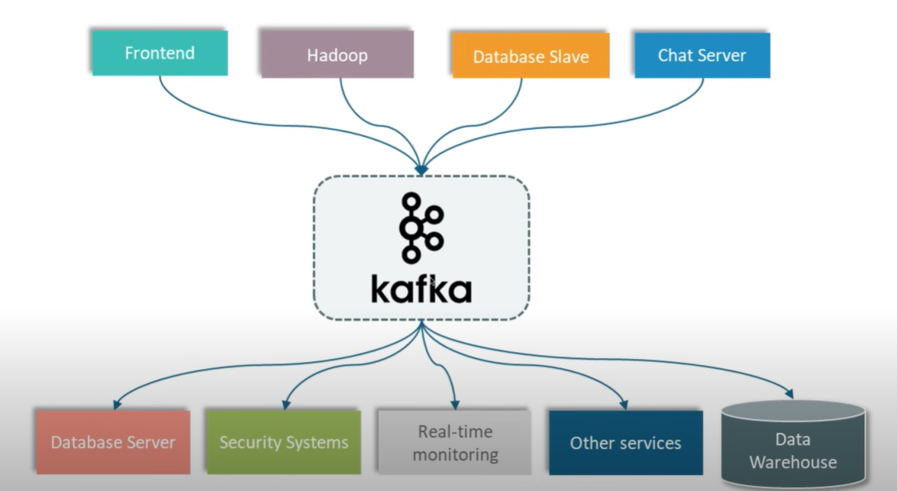
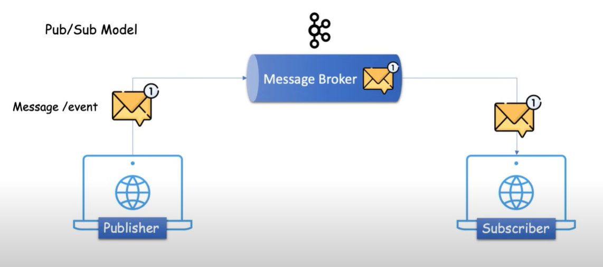
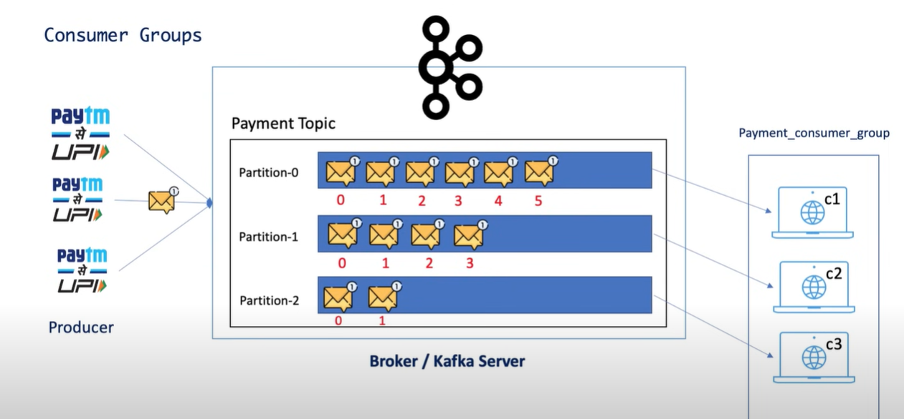

# Apache kafka

## What is kafka?
- Apache Kafka is an open-source distributed event streaming platform.
- It’s used for building real-time data pipelines and streaming applications.
- It lets you publish, subscribe to, store, and process streams of records (events/messages) efficiently.

## Where does kafka come from?
- Kafka was originally developed at LinkedIn to handle large volumes of activity logs.
- It was open-sourced in early 2011 and is now maintained by the Apache Software Foundation.

## Why do we need kafka?
- We use Kafka because:
    - It handles high-throughput, low-latency, and real-time data streaming.
    - It decouples producers and consumers — making systems more scalable and fault-tolerant.
    - It’s great for:
        - Microservices communication using events
        - Real-time analytics (e.g. fraud detection)
        - Log aggregation
        - ETL pipelines
        - IoT and sensor data ingestion
    - It persists messages so consumers can process them at their own pace, even if they go down temporarily.
  


## How does it work?




## Kafka Architecture and components
- Producer : A Producer is a Kafka client that publishes (sends) messages to a Kafka topic.
- Consumer : A Consumer is a Kafka client that reads (consumes) messages from a topic.
- Broker : Just a server or in other words, an entity that helps in message exchanges between a producer and consumer.
- Cluster : Group of servers or brokers
- Topic : It specifies the category of the message or the classification of the message. Listeners can then just respond to the messages that belong to the topics they are listening on.
- Partitions : A topic is split into partitions to enable parallel processing and scalability.
- Offset : An offset is the position ID of a message in a partition, used by consumers to track progress.
- Consumer Groups : A group of consumers that share the load of reading from a topic’s partitions.
- Zookeeper : A coordination service Kafka uses for managing cluster state, leader election, and broker metadata.




## Kafka Installation
- Open Source : Apache Kafka
### Using WSL (Windows Subsystem for Linux)
This is the cleanest way and closest to Linux environments.
1. Install WSL & Ubuntu
   - Run this in PowerShell:
     - ``` wsl --install```
   - Restart your PC if needed, and set up Ubuntu.
2. Install Java inside WSL
    - ``` sudo apt update```
    - ``` sudo apt install default-jdk -y```
3. Download and run Kafka
    Same steps as before:
   - ```wget https://downloads.apache.org/kafka/3.6.1/kafka_2.13-3.6.1.tgz```
   - ```tar -xzf kafka_2.13-3.6.1.tgz```
   - ```cd kafka_2.13-3.6.1```

### Producer-Consumer flow
1. Start Zookeeper
   ```bin/zookeeper-server-start.sh config/zookeeper.properties```
   Port: 2181
2. Start Kafka Server/Broker
   ```bin/kafka-server-start.sh config/server.properties```
   Port: 9092
3. Create a topic
    - To Create the topic: ```bin/kafka-topics.sh --bootstrap-server localhost:9092 --create --topic javaTutorial-topic --partitions 3 --replication-factor 1```
    - To list the topic : ```bin/kafka-topics.sh --bootstrap-server localhost:9092 --list```
    - To Describe the topic : ```bin/kafka-topics.sh --bootstrap-server localhost:9092 --describe --topic javaTutorial-topic```
4. Producer
   ```bin/kafka-console-producer.sh --broker-list localhost:9092 --topic javaTutorial-topic```
5. Consumer
   ```bin/kafka-console-consumer.sh --bootstrap-server localhost:9092 --topic javaTutorial-topic --from-beginning```